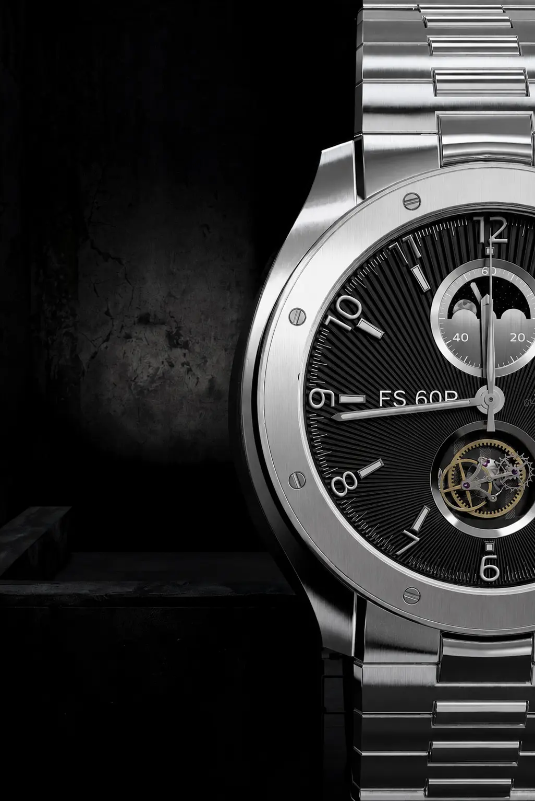

# ⌚ FS 60P — Next.js 3D WebGL Automatic Watch Showcase <p align="center">  </p> <p align="center"> <b>A cinematic, full-code recreation of a luxury interactive 3D watch experience</b><br/> Built with Next.js 14, TypeScript, Three.js, and Tailwind CSS. </p> <p align="center"> <a href="https://3d-watch-rho.vercel.app"></a>    </p> --- ## Overview **FS 60P** is a pixel-faithful,  It reproduces a high-end product marketing experience entirely in the browser — a photorealistic 3D watch model, real-time material customization, a mechanical exploded-view animation, and an editorial scroll-driven narrative — using a modern Next.js and Three.js stack. **🔗 Live Demo:** [3d-watch-rho.vercel.app](https://3d-watch-rho.vercel.app) --- ## ✨ Key Features | Feature | Description | |---|---| | 🎥 **Photorealistic 3D Rendering** | High-polygon mechanical watch model rendered with Three.js `WebGLRenderer`, using `ACESFilmicToneMapping` and `SRGBColorSpace` for accurate, cinematic color grading. | | 💡 **HDR Lighting & Reflections** | Environment lighting loaded via `EXRLoader`, producing photoreal brushed-metal and mirror-polish reflections across every surface. | | 🎨 **Dynamic 4-Colorway Customizer** | Real-time material and color swapping across both the 3D model and photography — Classic Steel, Titanium Dark, Yellow Gold, and Rose Gold. | | ⚙️ **Interactive Exploded Assembly** | A smooth mechanical disassembly animation that lerps gears, the balance wheel, crystal, dial, hands, ruby bearings, and the winding rotor along individual explosion vectors — controllable via slider or a one-click explode toggle. | | 🌊 **Kinetic Smooth Scrolling** | Lenis-powered scroll physics synchronize camera movement and layer offsets with the scroll timeline for a fluid, editorial feel. | | 🖋 **Luxury Editorial UI** | Custom Nekst and Inter typography, a technical horology specification ledger, and a 5-angle dynamic product photography gallery. | --- ## 🎨 Colorway Lineup | Code | Name | Material | |---|---|---| | `01` | **Classic Steel** | 316L Stainless Steel, satin brushed | | `02` | **Titanium Dark** | Grade 5 micro-blasted titanium, anthracite DLC coating | | `03` | **Yellow Gold** | 18K 3N alloy with champagne dial | | `04` | **Rose Gold** | 5N architectural rose gold | --- ## 🛠 Tech Stack - **Framework:** [Next.js 14](https://nextjs.org/) (App Router) - **Language:** [TypeScript](https://www.typescriptlang.org/) - **3D Engine:** [Three.js](https://threejs.org/) (`WebGLRenderer`, `EXRLoader`, GLTF pipeline) - **Styling:** [Tailwind CSS](https://tailwindcss.com/) - **Smooth Scroll:** [Lenis](https://lenis.darkroom.engineering/) - **Deployment:** [Vercel](https://vercel.com/) --- ## 🚀 Getting Started ### Prerequisites - Node.js 18+ - npm (or your preferred package manager) ### Installation ```bash git clone https://github.com/asad-developer99/3d-watch.git cd 3d-watch npm install ``` ### Development Server Run the app locally with hot-reloading: ```bash npm run dev ``` Then open **[http://localhost:3000](http://localhost:3000)** in your browser. ### Production Build ```bash npm run build npm start ``` --- ## 📁 Project Structure ``` . ├── public/ │   ├── favicon.png                  # Site favicon │   ├── share-image.webp             # Social OpenGraph image │   └── assets/ │       ├── watch-DXFPNOEl.glb       # 9.0 MB Three.js master 3D model │       ├── envmap-kW4EmG7W.exr      # High-dynamic-range EXR lighting map │       ├── default-Bo472-CV.json    # PBR physical material configuration │       ├── fonts/                   # Nekst and Inter font families (woff2, ttf) │       └── the-watch/img/           # 20 variant photography renders ├── src/ │   ├── app/ │   │   ├── layout.tsx               # Root layout — metadata & WatchProvider │   │   ├── page.tsx                 # Main showcase page (canvas + UI) │   │   └── globals.css              # Custom font declarations & global styles │   ├── context/ │   │   └── WatchContext.tsx         # Global state — colorways & exploded view │   ├── components/ │   │   ├── canvas/ │   │   │   └── WatchCanvas.tsx      # Client-side Three.js rendering engine │   │   ├── ui/ │   │   │   ├── Loader.tsx           # Circular SVG preloader │   │   │   └── Navbar.tsx           # Header with exploded-view toggle │   │   ├── sections/ │   │   │   ├── HeroSection.tsx      # Hero with interactive colorway pills │   │   │   ├── StorySection.tsx     # Editorial design narrative & specs │   │   │   ├── ExplodedSection.tsx  # Movement disassembly slider & guide │   │   │   ├── GallerySection.tsx   # 5-angle product photography gallery │   │   │   ├── SpecsSection.tsx     # Technical specification ledger │   │   │   └── Footer.tsx           # Credits & scroll-to-top │   │   └── SmoothScroll.tsx         # Lenis kinetic scroll controller ├── tailwind.config.ts               # Custom design tokens & typography ├── tsconfig.json                    # TypeScript configuration └── package.json                     # Dependencies & scripts ``` --- ## 🌐 Live Deployment The project is deployed on Vercel: **[https://3d-watch-rho.vercel.app](https://3d-watch-rho.vercel.app)** --- ## 👤 Author **Asad Mujtaba** Full-Stack Web Developer — Karachi, Pakistan - 🌐 Portfolio: [asad-mujtaba.is-a.dev](https://asad-mujtaba.is-a.dev/) - 💻 GitHub: [@asad-developer99](https://github.com/asad-developer99) - ✉️ Email: asad.developer99@gmail.com --- ## 📄 License This project is intended for educational and portfolio demonstration purposes. All rights to the original design concept belong to their respective creators.
